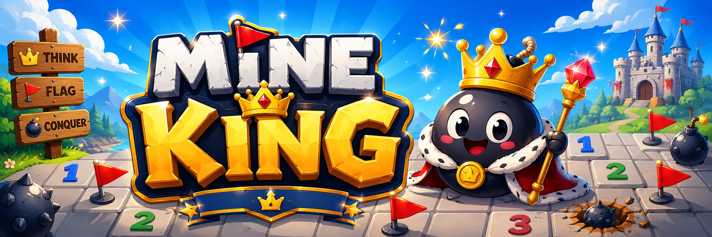
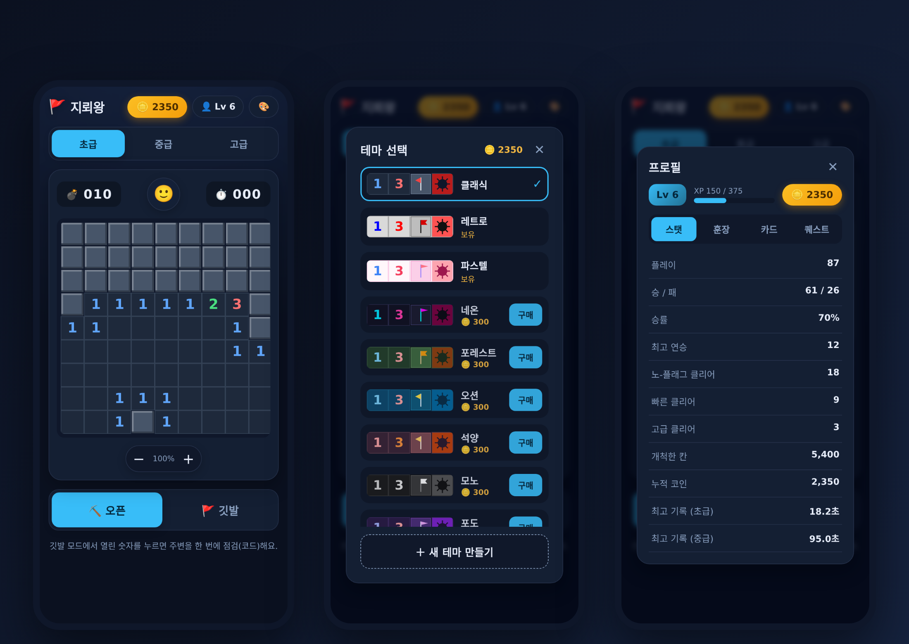

# MINE KING

Welcome! 🚩 **MINE KING** isn't your average Minesweeper.
Pick from a variety of themes, mix and match your own from scratch, or even
**draw your own** to make Minesweeper truly yours.

The flag shape, the number colors, the look of the board and the whole app —
all of it bends to your taste. Same Minesweeper, but never the same game twice.

**▶ Play now: https://mineking.netlify.app/**

## Features

- **Classic Minesweeper rules** — first-click safety, flag mode, chording
- **Magnifier loupe + zoom** — aim precisely even when your finger covers the cell
- **9 preset themes** — Classic, Retro, Pastel, Neon, Forest, Ocean, Sunset, Mono, Grape
- The active theme reskins **the whole app UI**, not just the board
- **Build your own theme** — background, tile and flag colors, flag shape, per-number colors
- **Image upload and on-device drawing** — replace number and flag glyphs with your own art
- **Installable PWA** — add to home screen, full-screen play, works offline
- **Cloud login** — sign in with a username and your progress follows you anywhere

## Tech

React, TypeScript, Vite, HTML Canvas, vite-plugin-pwa, Supabase.
